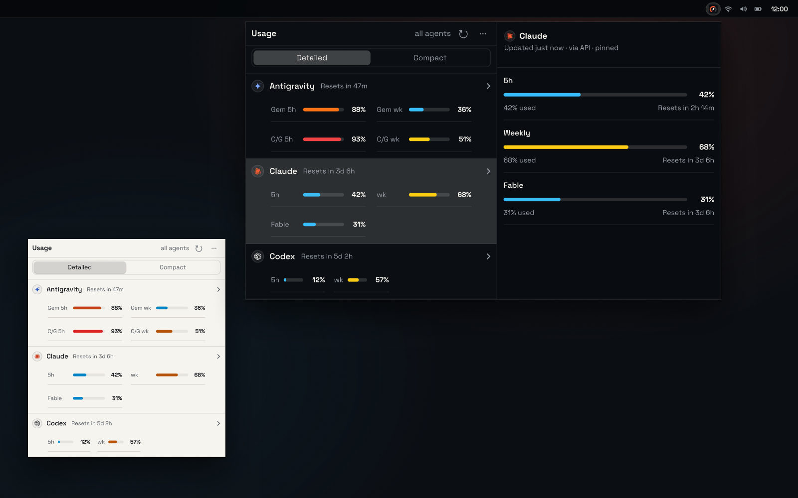
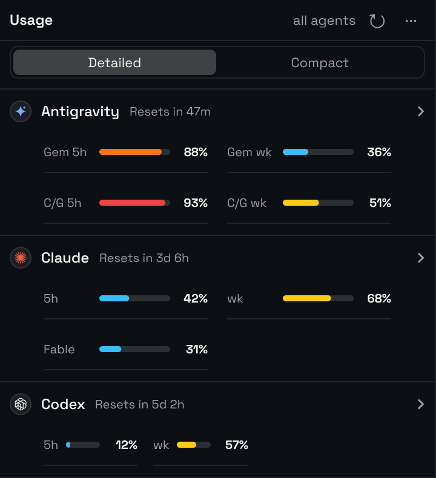
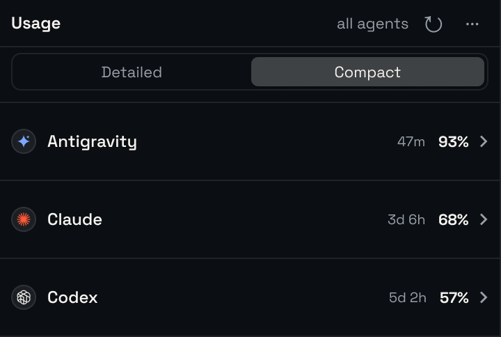
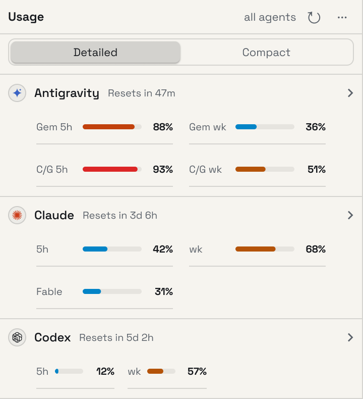

<p align="center">
  
</p>

<h1 align="center">Trayci</h1>

<p align="center">Claude Code, Codex, and Antigravity usage, one click away.</p>

<p align="center">
  <a href="https://github.com/reqhiem/trayci/actions/workflows/ci.yml"></a>
  <a href="https://github.com/reqhiem/trayci/releases"></a>
  <a href="LICENSE"></a>
</p>

<p align="center">
  <a href="https://reqhiem.github.io/trayci/">Website</a> ·
  <a href="https://github.com/reqhiem/trayci/releases/latest">Download</a> ·
  <a href="COMPATIBILITY.md">Compatibility</a>
</p>

<p align="center">
  
</p>

Trayci is a local-first system tray app for Linux and Windows. It shows how much of each Claude Code, Codex, and Google Antigravity quota window you have used and when it resets, in a popover one click from the tray. It reuses each provider CLI's existing sign-in and never stores credentials.

## Features

- **Every provider at a glance.** Claude Code, Codex, and Antigravity side by side, sorted by the limit closest to running out or in the order you choose.
- **Detailed or compact.** Detailed shows every window as a meter; compact shows each provider's tightest one. Hover a provider to open its detail pane, click to pin it.
- **Reset countdowns** for every window, including Antigravity's 5-hour and weekly limits for Gemini and Claude/GPT models.
- **Opt-in notifications** when a quota reaches 50, 85, or 90 percent, and when a reset completes.
- **Your way:** used or remaining percentages, light, dark, or system theme, and four text sizes.
- **Quietly current.** Refreshes every 5 to 60 minutes and after resume, flags stale readings, and keeps a credential-free cache so the popover opens instantly.
- **Drag it anywhere.** On X11 the popover reopens where you left it.
- **Native packages:** `.deb` and `.AppImage` for Linux amd64, an NSIS installer for Windows x64.

|                                                          Detailed                                                           |                                                          Compact                                                           |                                                 Light theme                                                 |
| :-------------------------------------------------------------------------------------------------------------------------: | :------------------------------------------------------------------------------------------------------------------------: | :---------------------------------------------------------------------------------------------------------: |
|  |  |  |

## Install

Download the latest release from [GitHub Releases](https://github.com/reqhiem/trayci/releases/latest).

AppImage, on any distribution:

```bash
chmod +x Trayci_*_amd64.AppImage
./Trayci_*_amd64.AppImage
```

Debian or Ubuntu:

```bash
sudo apt install ./Trayci_*_amd64.deb
```

Windows: run `Trayci_*_x64-setup.exe`.

Trayci needs at least one provider CLI that is installed and signed in: `claude`, `codex`, or `agy`.

## How it reads usage

| Provider    | Reads                                                                               | Falls back to                                                         |
| ----------- | ----------------------------------------------------------------------------------- | --------------------------------------------------------------------- |
| Claude Code | Anthropic's usage endpoint, with the sign-in Claude Code already keeps on your disk | The `claude` CLI's `/usage` panel                                     |
| Codex       | `codex app-server` over stdio                                                       | The `codex` CLI's `/status` panel                                     |
| Antigravity | The signed-in `agy` CLI's `/usage` panel                                            | Google Code Assist quota, when Gemini OAuth credentials are available |

Credentials are only read, never copied or written. On Linux, settings and a credential-free cache live in `$XDG_CONFIG_HOME/trayci`, or `~/.config/trayci` when it is unset.

## Platform notes

**Wayland.** The popover can be dragged, but only an X11 session remembers where it was left: GTK lets no Wayland client place its own window, so it reopens wherever the compositor puts it. Running `GDK_BACKEND=x11 trayci` is **not** a workaround — under XWayland the popover never takes input focus and the first click dismisses it instead of reaching the button.

**Windows.** `trayci.exe` is a GUI app, so an unpiped run does not make the shell wait: the output lands after the prompt and no exit code is recorded. Pipe it or wait on it to get both: `trayci.exe usage --json | ConvertFrom-Json` in PowerShell, `start /wait trayci.exe usage` in `cmd`.

Tested distributions and desktops are listed in [COMPATIBILITY.md](COMPATIBILITY.md).

## Command line

The installed binary answers diagnostics without opening the tray:

```bash
trayci usage --json        # every provider, as JSON
trayci usage antigravity   # one provider
trayci doctor              # which provider CLIs are installed and signed in
trayci --version
```

## Development

Trayci runs on Tauri 2: a Rust core in `src-tauri/` and a React renderer in the system WebView (`src/`). You need Linux amd64 or Windows x64, Node.js 22+, pnpm 9+, Rust 1.80+, the Tauri system dependencies (`libwebkit2gtk-4.1-dev libayatana-appindicator3-dev librsvg2-dev` on Debian/Ubuntu), and at least one signed-in provider CLI.

```bash
pnpm install
pnpm dev
```

| Task                    | Command                                                                |
| ----------------------- | ---------------------------------------------------------------------- |
| Format, lint, typecheck | `pnpm format:check`, `pnpm lint`, `pnpm typecheck` (or `make check`)   |
| Tests                   | `pnpm test`, `cargo test --workspace` in `src-tauri/` (or `make test`) |
| Installers              | `pnpm dist:linux`, `pnpm dist:win`                                     |
| Diagnostics from source | `pnpm cli -- usage --json`, `pnpm cli -- doctor`                       |

Lefthook formats staged files with Prettier before each commit. Run `pnpm exec lefthook install` if the hook is missing.

The website lives in `site/` (Astro) and deploys to GitHub Pages from `main`. Preview it with `pnpm install && pnpm dev` inside `site/`.

## Releases

Pull requests and pushes to `main` run CI and upload Linux and Windows builds as artifacts. To publish a release, update the version in `package.json` and push the matching tag, for example `v0.5.0`; GitHub Actions builds the installers and attaches them to the release.

## Contributing

Issues and pull requests are welcome. Check the [roadmap](https://github.com/reqhiem/trayci/projects) and [open issues](https://github.com/reqhiem/trayci/issues), keep changes focused, and include tests for behavior changes. The pull request template lists the expected checks.

## License

Trayci is available under the [MIT License](LICENSE). It is not affiliated with Anthropic, OpenAI, or Google.
